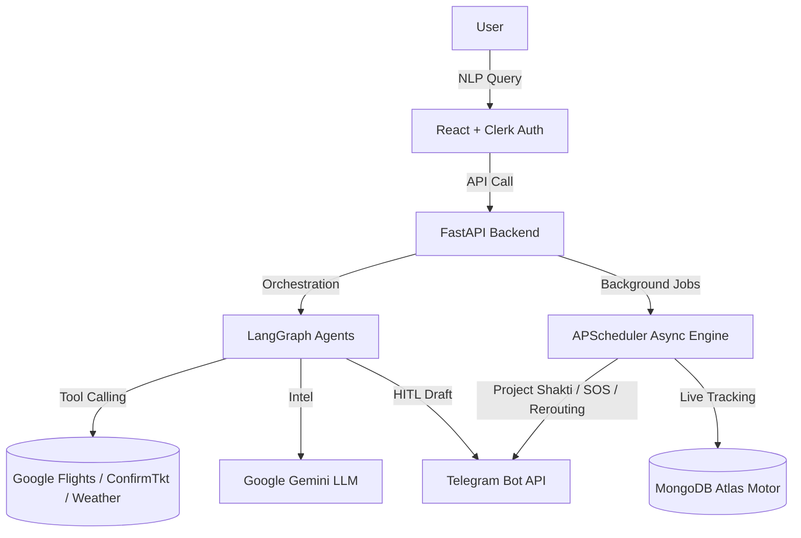

<div align="center">
  

  # Agentra OS 🚄✈️
  
  **The World's First Autonomous, Multi-Agent Travel Operating System.**

  [](#)
  [](#)
  [](#)
  [](#)

  <p align="center">
    <strong>Intelligent Routing • Predictive Waitlisting • Military-Grade SOS • Zero-Latency Orchestration</strong>
  </p>
</div>

---

## 📖 The Vision & Problem Statement

Modern travel planning is fragmented. Users constantly juggle between flight aggregators, IRCTC train portals, weather apps, and cab services. **Agentra OS** is an end-to-end multi-agent orchestration engine built to eliminate this friction. 

Powered by **LangGraph state machines** and the **Gemini AI API**, Agentra is not a simple Q&A chatbot. It is a proactive transit operating system that autonomously executes multi-leg bookings, predicts waitlist confirmations via dynamic algorithms, and orchestrates the entire transit lifecycle—from real-time alternative rerouting to automated cab dispatches and military-grade anti-theft SOS protocols.

---

## 🔄 The Agentra Lifecycle: An End-to-End Execution Flow

Agentra is architected to handle every micro-interaction and edge case from T-48 hours before departure to post-arrival check-ins. Here is how the system orchestrates a journey in real-time:

### Phase 1: Contextual Planning & Human-in-the-Loop (HITL) Booking
The LangGraph NLP agent parses natural language queries and triggers autonomous tool calling.
* **Live Tool Execution:** Fetches real-time seat availability, live prices, and historical delay baselines from Google Flights and IRCTC (via ConfirmTkt).
* **Pre-Booking Intel:** Analyzes weather constraints and dynamic pricing (e.g., advising if a flight is currently above average fare).
* **Secure HITL Drafts:** Generates a pre-filled, secure checkout draft. The link is dispatched concurrently to the React Web Dashboard and the user's Telegram bot for human verification and payment simulation.

<table width="100%">
  <tr>
    <td valign="top" width="50%">
      
    </td>
    <td valign="top" width="50%">
      
    </td>
  </tr>
</table>

### Phase 2: The Smart Vault & Predictive Waitlist Engine
Once a booking is paid and the PNR is generated, it enters the **Agentra Vault** for 24/7 background monitoring via async Cron jobs.
* **Algorithmic Waitlist Analysis:** If a ticket is waitlisted (e.g., RLWL), Agentra calculates confirmation probability against seasonal and route-specific thresholds.
* **Hub-and-Spoke Rerouting:** If probability drops below the 55% safety threshold at T-48 hours, the agent dynamically stitches multi-modal routes (e.g., 2-hour Cab to an intermediate junction + Confirmed Train to destination) and pushes actionable backup options to the user before prices surge.

<table width="100%">
  <tr>
    <td valign="top" width="100%" align="center">
      
    </td>
  </tr>
</table>

### Phase 3: T-1.5 Hours Chart Protocol & Transit Initiation
At the precise moment of train chart preparation or flight web check-in, Agentra shifts into active orchestration mode.
* **Seat Allocation & First-Mile Transit:** Pushes exact confirmed berth/seat details and offers an instant local cab integration (Ola/Rapido) to reach the boarding terminal on time.
* **In-Transit Dining:** Proactively asks if food is packed; if not, triggers an E-Catering tool to deliver regional meals (e.g., Masala Dosa) directly to the allocated berth.
* **Safety Check-ins:** Pings the user 20 minutes post-departure to confirm safe boarding.

<table width="100%">
  <tr>
    <td valign="top" width="50%">
      
    </td>
    <td valign="top" width="50%">
      
    </td>
  </tr>
</table>

### Phase 4: Project Shakti & Anti-Theft Protocol 🛡️
Transit security is deeply integrated into the OS layer. Agentra actively guards vulnerable demographics, specifically solo female travelers.
* **Project Shakti:** Automatically identifies solo female manifests, pre-links the PNR with the RPF Women's Squad, and maintains active background GPS tracking.
* **Device Compromise Override:** If a phone is stolen during transit, the user can override the system from *any* other device using a secret keyword.
* **Zero-FIR Automation:** Agentra auto-locks the compromised account, broadcasts live train coordinates/speed to emergency contacts, and dispatches a Zero-FIR directly to the Railway Protection Force (RPF) Cyber Cell, routing help directly to the passenger's seat within seconds.

<table width="100%">
  <tr>
    <td valign="top" width="33%">
      
    </td>
    <td valign="top" width="33%">
      
    </td>
    <td valign="top" width="33%">
      
    </td>
  </tr>
</table>

### Phase 5: Last-Mile Arrival & Smart Itinerary Generation
* **Wake-up Calls & ETA Sync:** Provides hourly delay updates and a T-30 minute automated wake-up call before arrival.
* **Destination Cab:** At T-10 minutes, Agentra cross-references live train speed to pre-book a cab, ensuring the driver is waiting exactly at the station exit.
* **Stay & Explore:** Upon arrival, the agent queries stay duration and purpose, locking in optimal hotel accommodations. 
* **The Final Output:** Generates a highly personalized, AI-crafted City Exploration Itinerary and dispatches a comprehensive PDF travel expense invoice to Telegram.

<table width="100%">
  <tr>
    <td valign="top" width="50%">
      
    </td>
    <td valign="top" width="50%">
      
    </td>
  </tr>
</table>

---

## 🏗️ System Architecture & Engineering Constraints

The core challenge of Agentra was ensuring zero LLM hallucinations and 100% stable frontend rendering while maintaining concurrent background processes.



### Engineering Highlights:
1. **Strict JSON Schemas:** Enforced rigid Pydantic schemas on the Gemini output to eliminate geographical and chronological hallucinations, ensuring the React UI never crashes due to malformed LLM responses.
2. **Asynchronous Throughput:** Utilized FastAPI and Motor (Async MongoDB driver) to handle simultaneous Telegram webhooks and React dashboard polling without thread-blocking.
3. **Cross-Tab Communication:** Implemented advanced local storage event listeners to ensure secure, real-time sync between the payment checkout tab and the main agent dashboard.

---

## 💻 Tech Stack

### **Frontend Infrastructure**
* **Framework:** React.js (Vite)
* **Styling & UI:** Tailwind CSS, Lucide Icons, Custom Glassmorphism components.
* **Authentication:** Clerk Auth (JWT-based secure sessions).
* **Hosting:** Vercel

### **Backend & AI Engine**
* **Core API:** FastAPI, Python 3.12, Uvicorn.
* **AI Orchestration:** LangGraph, LangChain, Google Gemini API (1.5 Flash).
* **Database & Background Ops:** MongoDB Atlas (Motor Asyncio), APScheduler (Cron Engine).
* **External Integrations:** Telegram Bot API, ReportLab (PDF Generation), RapidAPI (Flights & Trains).
* **Hosting:** Render

---

## 🚀 Local Development Setup

### 1. Clone & Backend Setup
```bash
git clone https://github.com/Yogesh-max2123/Agentra-OS.git
cd backend
python -m venv venv
source venv/bin/activate  # On Windows: venv\Scripts\activate
pip install -r requirements.txt
```

Create a `.env` in the `backend` directory:
```env
MONGO_URI=mongodb+srv://<user>:<password>@cluster.mongodb.net/?appName=AgentraOS
TELEGRAM_BOT_TOKEN=your_telegram_bot_token
GEMINI_API_KEY=your_gemini_api_key
FRONTEND_URL=http://localhost:5173
```

Run the ASGI server:
```bash
uvicorn main:app --reload --port 8000
```

### 2. Frontend Setup
```bash
cd ../frontend
npm install
```

Create a `.env` in the `frontend` directory:
```env
VITE_API_BASE_URL=http://localhost:8000
VITE_CLERK_PUBLISHABLE_KEY=your_clerk_publishable_key
```

Run the client development server:
```bash
npm run dev
```

### 3. Telegram Webhook Linkage (Local Testing)
To enable the backend to receive real-time updates from Telegram locally, expose your port 8000 using ngrok:
```bash
ngrok http 8000
```

Copy the secure `https://` forwarding URL provided by ngrok and register the webhook via your browser:
```text
[https://api.telegram.org/bot](https://api.telegram.org/bot)<YOUR_BOT_TOKEN>/setWebhook?url=<YOUR_NGROK_HTTPS_URL>/api/webhook
```

---
<div align="center">
  <i>Architected with precision. Engineered for zero-stress travel.</i>
</div>
